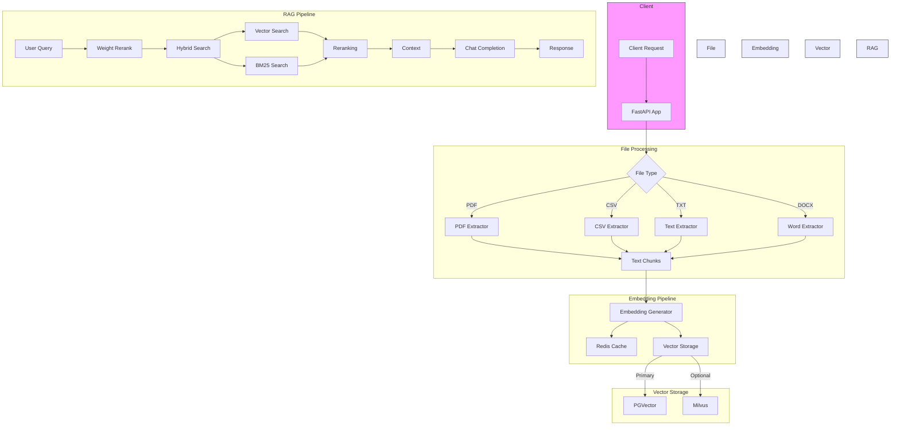

# Advanced RAG System

An advanced Retrieval-Augmented Generation (RAG) system built with FastAPI, featuring hybrid search, vector databases, and intelligent reranking.

## 🌟 Features

- **Hybrid Search**: Combines vector similarity and BM25 text search
- **Multiple Vector Databases**: Support for PGVector and Milvus
- **Embedding Caching**: Redis-based caching for improved performance
- **Smart Reranking**: Weight-based reranking system
- **REST API**: FastAPI-powered endpoints for file upload and chat

## 🏗️ Architecture



Key Components:

1. **File Processing**
   - Supports multiple file formats (.pdf, .csv, .txt, .docx)
   - Specialized extractors for each format
   - Chunks text for optimal processing

2. **Embedding Pipeline**
   - Generates embeddings using OpenAI's API
   - Caches embeddings in Redis
   - Stores vectors in database

3. **Vector Storage**
   - Primary: PGVector (PostgreSQL)
   - Optional: Milvus support
   - Efficient vector similarity search

4. **RAG Pipeline**
   - Hybrid search combining vector and keyword approaches
   - Weight-based reranking
   - Context-aware chat completion
   - Stateless response generation

## 🚀 Quick Start

### Prerequisites

- Docker and Docker Compose
- Python 3.8+
- OpenAI API Key

### Environment Setup

1. Clone the repository:

bash
git clone <repository-url>
cd advanced-rag

2. Copy the example environment file and configure your settings:

bash
cp .env.example .env

3. Start the services using Docker Compose:

bash
docker-compose up -d

4. Run the application:

bash
./run.sh

## 🔧 Configuration

Create a `.env` file with the following variables:

```env
OPENAI_API_KEY=your_api_key_here
POSTGRES_USER=postgres
POSTGRES_PASSWORD=postgres
POSTGRES_DB=vectordb
REDIS_HOST=localhost
REDIS_PORT=6379
```

## 📚 API Endpoints

### Upload Document
```http
POST /upload
Content-Type: multipart/form-data

file: <file>
```

### Chat
```http
POST /chat
Content-Type: application/json

{
    "message": "your question here",
    "history": ["optional chat history"]
}
```

## 🛠️ Components

### 1. Embedding Generation
- Located in `src/embedding/third_party.py`
- Supports OpenAI's embedding API
- Handles batch processing of text chunks

### 2. Weight Reranking
- Located in `src/search/weight_rerank.py`
- Combines multiple search strategies
- Implements smart reranking algorithm

### 3. Caching System
- Located in `src/cache_embedding.py`
- Redis-based embedding cache
- Improves response time for repeated queries

### 4. Utility Functions
- Located in `src/utils.py`
- Chat completion handlers
- Helper functions for text processing

## 🐳 Docker Services

The `docker-compose.yml` includes:
- PostgreSQL with pgvector extension
- Redis for caching
- Milvus vector database
- Application service

## 🤝 Contributing

1. Fork the repository
2. Create your feature branch (`git checkout -b feature/amazing-feature`)
3. Commit your changes (`git commit -m 'Add amazing feature'`)
4. Push to the branch (`git push origin feature/amazing-feature`)
5. Open a Pull Request

## 📄 License

This project is licensed under the MIT License - see the LICENSE file for details.

## 🙏 Acknowledgments

- OpenAI for embedding and completion APIs
- FastAPI framework
- Vector database communities (Milvus, pgvector)

